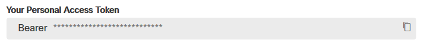
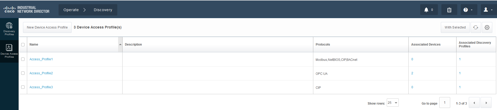
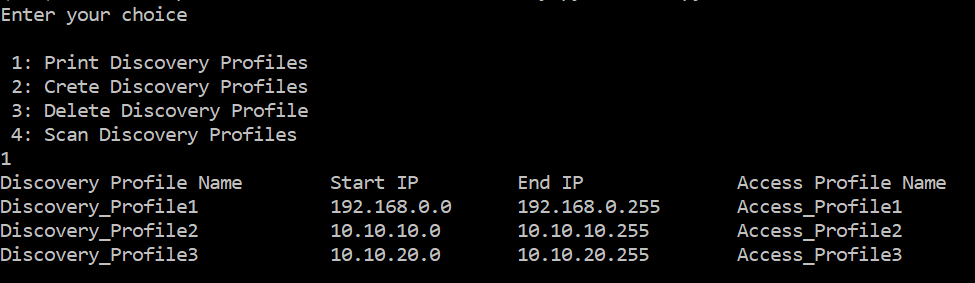
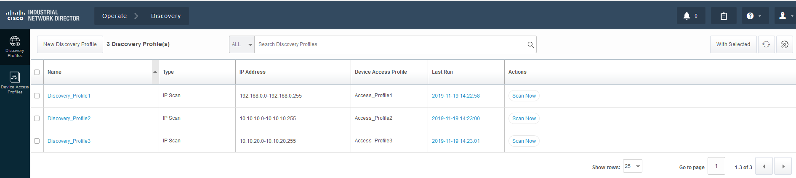
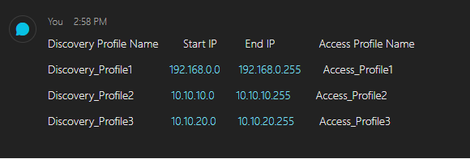

# Cisco IND-Discovery-Profile-Python
Create, Scan, Print and Delete the IND (Industrial Network Director) Discovery Profiles using Python

## Pre-requisites -
	1.	The python script is tested with 3.6.5 version
	2.	requirements.txt (included in the repo)
	3. 	devices.csv file (included in the repo)
	4.	WebEx Teams account (along with room id and user token)
	5. 	Cisco Industrial Network Director (in this case, IND 1.7.1 was installed on local computer)
	6. 	Access Prfoile must have been created in IND prior to running script

## Cisco Industrial Network Director -

The Cisco Industrial Network Director is an easy-to-adopt network management system for industrial automation. It is specifically designed to help operations teams manage automation by providing full visibility and control of the Industrial Ethernet infrastructure in the context of the automation process.
For information, please visit https://www.cisco.com/c/en/us/products/cloud-systems-management/industrial-network-director/index.html

## Script Summary -

The goal of the python script is create, print, delete and scan the discovery profiles and output the result in command prompt as well as in WebEx Teams room.

## Detailed Steps -

When you clone the repo, it includes folowing files -
1.	env_lab.py (IND dteails are defined including credentials)
2.	env_user.py (your WebEx Teams user token and room ID are defined in this file)
3.	devices.csv (discovery profile fields are defined here)
4.	There is one more file called as JasonRecords.json which will be created when you run discovery.py
5.	discovery.py (this is the file you will run)

2.	Run following commands on your computer (in this case, Windows machine is used so)
	1.	git clone https://github.com/vpralhad/IND-Discovery-Profile-Python
	2.	cd IND-Discovery-Profile-Python
	3.	python -m venv venv
	4.	pip install requirements.txt

3.	WebEx Teams -
	1.	Create a room in WebEx Teams
	2.	Add RoomID bot to the room which will create a room id to use in env_user.py (var name SPARK_ROOM_ID)
	2.	go to https://developer.webex.com/
	2.	Make sure you are loogedn in click on Documentation on top and go to Getting Started page
	3.	By scrolling further down, copy the Bearer token (valid for 12 hours) and paste it to env_user.py file (var name 		- SPARK_ACCESS_TOKEN)
	
	
	
4.	Create Access Profile in IND by going into operate-->Discovery-->Device Access Profiles-->New Device Access Profiles (in 
	this case, 2 access profiles were created)
	
	### Sample Output -
	
	
5.	Running the script -
	1.	Run "python discovery.py" (Enetr 1 for printing discovery profiles, 2 for creating, 3 for deleting and 4 for	scanning 		the profiles)
	
	### Sample output -
	
	
	
	2. Check if the discovery profiles were created by logging into the IND dashboard  						(https://xx.xx.xx.xx:8443)-->Operate-->Discovery-->Discovery profiles
	### Sample output -
	
	
	3. Check the WebEx Teams where you created the room. It should have same output as you got in command prompt.
	
	### Sample output -
	
	
